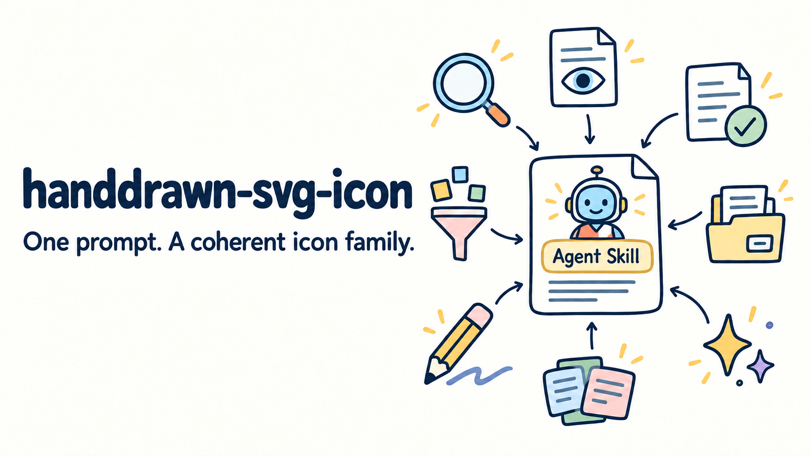

# handdrawn-svg-icon



An Agent Skill for creating coherent, editable hand-drawn SVG icon families for research figures, technical diagrams, and presentation slides.

It turns a short semantic brief into native SVG files with a consistent visual language: dark rounded outlines, restrained pastel fills, readable silhouettes, and controlled hand-drawn irregularity. The output stays editable—no embedded raster images, tracing artifacts, or image-generation dependency.

## What it creates

<table>
  <tr>
    <td align="center"><br><sub>Coordinator</sub></td>
    <td align="center"><br><sub>Decomposition</sub></td>
    <td align="center"><br><sub>Web search</sub></td>
    <td align="center"><br><sub>Selector</sub></td>
    <td align="center"><br><sub>Selected memory</sub></td>
  </tr>
</table>

The skill is designed for icon **families**, not isolated one-off illustrations. Every icon in a set shares the same canvas, outline weight, palette, visual scale, and level of detail.

## Install

### Ask your agent to install it (recommended)

Copy this message into Codex, Claude Code, Cursor, or another Agent Skills-compatible coding agent:

```text
Install this Agent Skill for me:
https://github.com/aowang-ai/handdrawn-svg-icon

Install it globally for the coding agent I am currently using. Use the
standard skills CLI if available, install the complete skill directory
including its assets, references, and scripts, and verify that the
handdrawn-svg-icon skill is discoverable after installation.
```

### Install with the skills CLI

The open-source [`skills` CLI](https://github.com/vercel-labs/skills) detects supported agents and installs the complete skill folder:

```bash
npx -y skills@latest add aowang-ai/handdrawn-svg-icon
```

To install it globally for a specific agent without interactive prompts:

```bash
# Codex
npx -y skills@latest add aowang-ai/handdrawn-svg-icon \
  --agent codex --global --yes

# Claude Code
npx -y skills@latest add aowang-ai/handdrawn-svg-icon \
  --agent claude-code --global --yes
```

Start a new agent session after installation so the skill can be discovered.

### Manual fallback

If `npx` is unavailable, clone the repository:

```bash
git clone https://github.com/aowang-ai/handdrawn-svg-icon.git
```

Then copy the complete repository into the directory used by your agent:

```bash
# Codex
mkdir -p ~/.codex/skills
cp -R handdrawn-svg-icon ~/.codex/skills/

# Claude Code
mkdir -p ~/.claude/skills
cp -R handdrawn-svg-icon ~/.claude/skills/
```

For a project-local installation using the shared Agent Skills convention:

```bash
mkdir -p .agents/skills
cp -R handdrawn-svg-icon .agents/skills/
```

## Use

Invoke the skill by name and describe the complete icon family you need:

```text
Use $handdrawn-svg-icon to create a coherent icon set for web search,
page reading, evidence extraction, conflict detection, and synthesis.
Save each icon as a separate editable SVG.
```

It can also restyle existing SVG assets:

```text
Use $handdrawn-svg-icon to redraw the SVG icons in ./figures/icons.
Keep their meanings, but make the whole set match the bundled hand-drawn
academic style. Preserve one SVG file per icon.
```

Or give art direction for a particular figure:

```text
Create six 96×96 SVG icons for a multi-agent research workflow:
coordinator, scheduler, worker, shared workboard, evidence selector,
and final answer. Use transparent backgrounds and make them legible at 40 px.
```

For the most consistent result, specify:

- the complete list of concepts;
- where the icons will be used;
- the desired output directory;
- any metaphor that must be kept or avoided;
- whether existing icons should be restyled rather than replaced.

## Output contract

By default, the skill produces:

- one standalone SVG per semantic concept;
- a transparent `96 × 96` canvas with a square `viewBox`;
- native paths and SVG primitives instead of embedded images;
- accessible `<title>` and `<desc>` elements;
- rounded strokes and a consistent dark blue-gray outline;
- no gradients, shadows, filters, scribble overlays, or visual text;
- a silhouette that remains recognizable at approximately 40 px.

The full visual grammar—including palette, stroke hierarchy, spacing, and controlled-imperfection rules—is documented in [the style specification](references/style-spec.md).

## Validate an icon set

The bundled validator uses only the Python standard library:

```bash
python scripts/validate_icon_set.py path/to/icon.svg
python scripts/validate_icon_set.py path/to/icon-directory
```

It checks structural requirements such as XML validity, square canvases, accessibility metadata, raster or external references, prohibited filters and text, rounded stroke settings, and excessive shape complexity.

Validation is a structural gate, not a substitute for visual review. Preview the icons together at both their working size and final small size before using them in a figure.

## Design principles

1. **Compress the meaning.** Use one primary noun or action, one supporting cue, and at most one state accent.
2. **Draw a stable silhouette first.** The icon must read before internal details are added.
3. **Keep imperfection controlled.** Slight asymmetry gives a hand-drawn character; duplicated jitter and noisy scribbles do not.
4. **Judge the family as a system.** Consistency across icons matters more than making one icon unusually elaborate.
5. **Keep the SVG genuinely editable.** Prefer simple paths and primitives that remain easy to recolor, resize, and revise.

## Repository structure

```text
handdrawn-svg-icon/
├── SKILL.md                         # Agent instructions and workflow
├── agents/
│   └── openai.yaml                  # Codex skill metadata
├── assets/
│   ├── icon-template.svg            # Reusable 96×96 SVG scaffold
│   ├── skill-icon.svg               # Skill identity icon
│   └── style-reference/             # Approved reference icon family
├── references/
│   └── style-spec.md                # Detailed visual specification
└── scripts/
    └── validate_icon_set.py         # Dependency-free SVG validator
```

## Best suited for

- research-paper method figures;
- system architecture and workflow diagrams;
- technical presentation slides;
- compact interface or legend symbols;
- restyling an inconsistent SVG collection into one visual family.

For a complete architecture diagram, use this skill to create the icon assets, then assemble the layout with a diagram or vector-figure workflow. It is intentionally focused on standalone icons rather than full-page composition.
